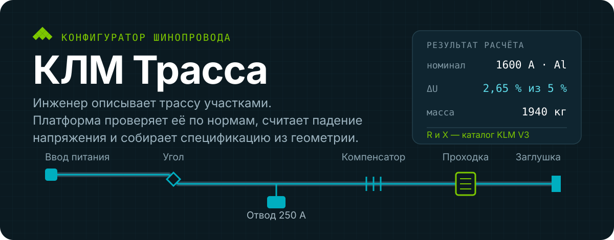
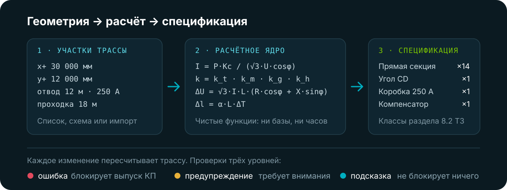
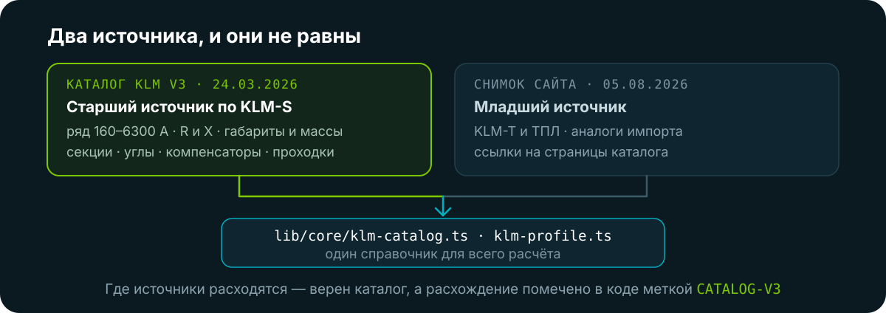

<p align="center">
  
</p>

Платформа расчёта и конфигурирования шинопроводных систем КЛМ по техническому заданию
«КЛМ Трасса», редакция 3.0.

Инженер описывает геометрию трассы — направление участков, длины, номиналы, точки отбора,
пересечения стен. Из этой геометрии платформа сама собирает перечень элементов, проверяет
конфигурацию по нормам и показывает **как получено каждое число**, а не только ответ.
Конфигурация с ошибкой в коммерческое предложение не уходит.

> **Статус: фундамент готов, спецификация без артикулов.** Работают расчётное ядро,
> конструктор трассы, публичный калькулятор, кабинет, роли и аудит. Спецификация собирается
> по классам элементов, но без артикулов и цен — номенклатура завода ещё не передана.
> Ценообразование, КП, заказы и документы — следующие этапы.

---

## Как геометрия становится спецификацией

<p align="center">
  
</p>

Ядро — чистые функции: ни базы, ни сети, ни `Date.now()` внутри расчёта. На вход идут
исходные данные и снимок справочника, на выход — результат **с трассировкой**: какое правило
сработало, какие числа подставлены, на какой пункт норматива опирается вывод. Это то, что
отличает инструмент от чёрного ящика и что позволяет инженеру защищать решение перед экспертизой.

Реальный прогон, 100 м алюминия при расчётном токе 1500 А:

```
номинал     1600 А из ряда каталога (запас 6,7 %)
поправка    k = k_t · k_m · k_g · k_h
ΔU          2,65 % при пределе 5 % — ТП → ГРЩ, ПУЭ 1.2.21
масса       1940 кг (19,4 кг/м × 100 м, каталог V3 стр. 7)
```

Та же трасса на 250 м даёт `ΔU 6,63 %` — и это **ошибка**, которая блокирует выпуск КП,
а не сноска мелким шрифтом.

<details>
<summary>Неочевидное: медь почти не выигрывает по ΔU</summary>

На номинале 1600 А медь даёт 2,61 % против 2,65 % у алюминия — разница в пределах округления.
Завод ставит на медь меньшее сечение (600 мм² против 960 у алюминия), и сопротивления сходятся.
Медь берут ради габарита и массы, а не ради потерь. До появления каталога панель не могла
этого показать.
</details>

---

## Откуда берутся числа

<p align="center">
  
</p>

Каталог опроверг шесть утверждений публичного сайта, и три из них меняли результат расчёта:

| Было (по сайту) | Стало (каталог V3) |
|---|---|
| ряд 160–2000 и 10 000 А | **160–6300 А**, добавлены 315 и 500 А |
| 160–2000 А только в меди | медь и алюминий **на всём ряду** |
| IP54 / 55 / 65 / 68 | IP55 / IP68 |
| у магистрали нет окон отбора | Plug-in в окно до 630 А, Bolt-on на стык до 1250 А |
| с окна снимается 250 А | **630 А** |
| компенсаторы по допуску стыка | норма завода: Al 30 м, Cu 45 м прямого участка |
| габариты углов неизвестны | CD 435 мм, CP по номиналу — длина вычитается из участков |
| KLM-R 100–1600 А | **160–630 А** (уточнено заказчиком 14.08.2026) |

`data/klm-catalog/` — сам каталог, 27 страниц, с таблицей «страница → куда легло» и порядком
повторной оцифровки. Текстового слоя в PDF нет (выгрузка из CorelDRAW), таблицы читались
рендерингом страниц в 300 dpi; контролем служили соотношение `Z = √(Ra² + X²)` и температурный
пересчёт — сошлись на всех 32 строках.

`data/klm-source/` — снимок публичного сайта: 537 страниц, 221 товар, 10 категорий, логотип
и 50 фотографий объектов. Панель `/podbor` считает целиком на локальных данных: если сайт-источник
станет недоступен, она работать не перестанет.

---

## Быстрый старт

```bash
npm install
cp .env.example .env.local     # DATABASE_URL до локального Postgres
createdb klm_dev
npm run db:migrate             # применить миграции
npm run db:seed                # тенант, организации, администратор
npm run dev                    # http://localhost:3000
```

```bash
npm test                       # ядро и приём заявок, без базы — 162 теста
npm run test:db                # против настоящей базы — 20 тестов
npm run build
npm run lint
```

## Страницы

| Путь | Содержание |
|---|---|
| `/calc` | **Публичный калькулятор** — мастер из четырёх шагов, результат без регистрации, заявка |
| `/app/route` | **Конструктор трассы** — участки, схема на канве, версии, автосохранение |
| `/podbor` | Выбор шинопровода — помощник каталога на данных КЛМ |
| `/demo` | Конфигуратор КОМ: живой артикул, десять проверок, автоисправление, печать |
| `/sravnenie` | Шинопровод против кабеля: сечение, масса металла, потери |
| `/app` | Кабинет: проекты, роли, организации |
| `/widget` | Встраиваемый `<iframe>` для сайтов дилеров, заявки падают на конкретного дилера |
| `/` · `/scope` · `/data` · `/policy` | Лендинг, границы этапа, запрос данных, обработка ПДн |

## Архитектура

Расчётное ядро не зависит ни от интерфейса, ни от базы — это делает его тестируемым
и переносимым в white-label.

| Модуль | Ответственность |
|---|---|
| `lib/core/klm-catalog.ts` | справочник серий, ряды номиналов, коробки отбора, нормы раскладки |
| `lib/core/klm-profile.ts` | таблицы каталога V3: сечение, R, X, Z при 20/35/40 °C, габариты, массы |
| `lib/core/select-busbar.ts` | подбор: ток, поправки, номинал, IP, ΔU, масса, трассировка |
| `lib/core/route.ts` | модель трассы: участки, изломы, отводы, пересечения → перечень элементов |
| `lib/core/electrical.ts` | ΔU, потери и их стоимость, токи КЗ, тепловое расширение, подвесы |
| `lib/core/cable.ts` | кабельная альтернатива: сечение по ПУЭ, масса металла, сравнение потерь |
| `lib/core/engine.ts` | подмодуль КОМ: десять правил, подбор корпуса, сборка кода заказа |
| `lib/dal/` | слой доступа: сессия, тенант, матрица прав раздела 11.2 |
| `components/` · `app/` | интерфейс и маршруты App Router; иконки и схемы — инлайновый SVG |

Анимация задаётся CSS-классами, поэтому `prefers-reduced-motion` отключает движение
автоматически. Внешних UI-библиотек нет.

## База данных

PostgreSQL, схема — раздел 10 ТЗ, миграции Drizzle только вперёд (`drizzle/`). Заведены таблицы
фундамента: тенанты, организации, пользователи, членство, сессии, приглашения, проекты,
конфигурации и их версии, журнал аудита, расчётный журнал. Справочники, прайсы, КП и заказы
появятся вместе со своими этапами — заводить их сейчас значило бы писать мёртвую схему.

Конфигурация трассы версионируется: каждое сохранение создаёт версию с автором, временем
и снимком результата целиком. Конструктор шлёт черновик на сервер при простое 3 с и параллельно
держит копию в браузере на случай закрытия вкладки.

Соединение берётся только из `lib/db/index.ts`: там маркер `server-only`, ломающий сборку при
попытке утащить строку подключения в клиентский бандл. Прямой импорт `lib/db/client`
из `app/` и `components/` запрещён линтером.

## Вход, роли и защита данных

Три рубежа, а не один:

1. **`proxy.ts`** — оптимистичная проверка: есть ли кука сессии и сходится ли подпись.
   Обращений к базе нет намеренно: Proxy выполняется на каждом маршруте, включая предзагружаемые.
   В Next 16 это бывший middleware, переименованный в Proxy.
2. **`lib/dal`** — слой доступа. Каждая функция начинается с проверки сессии и фильтрует
   по тенанту и организациям пользователя. Компоненты в базу не ходят.
3. **RLS в Postgres** — второй рубеж на случай ошибки в коде. Слой доступа выставляет
   `app.tenant_id` на соединение; без него не видно ни одной строки.

Пароли — argon2id, память 64 МБ, три итерации. В куке лежит подписанный идентификатор,
в базе — только SHA-256 от токена: дамп базы не даёт войти, а сессию можно отозвать.
Пять неудачных попыток блокируют вход на 15 минут.

Журналы `audit_log` и `calc_log` только на добавление: права UPDATE и DELETE отозваны у роли
приложения миграцией, переписать историю нельзя даже при ошибке в коде. Секреты маскируются
на уровне сериализатора.

> **Важно для развёртывания.** Сейчас приложение подключается владельцем схемы, который RLS
> обходит. Чтобы второй рубеж заработал, в промышленной среде строка подключения должна
> использовать роль `klm_app`.

## Что считается, а что нет

**Считается на заводских данных:** ток нагрузки, поправки на условия прокладки, номинал из ряда,
IP по среде, падение напряжения, потери и их стоимость, тепловое расширение, подвесы, раскладка
отводов, перечень элементов трассы, масса.

**Отраслевые допущения** — помечены в коде меткой `ponytail:`:

- поправка на температуру, отсчёт от 35 °C по ГОСТ Р МЭК 61439-1:
  35 → 1,00 · 40 → 0,97 · 45 → 0,94 · 50 → 0,90 · 55 → 0,86, между точками линейно;
- норма запаса по току 15–35 %;
- шаг подвесов и расчётный перепад температуры шин — каталогом не заданы;
- порог обязательной рукоятки КОМ 125 А;
- коэффициент одновременности отводов 1,0 — заведомо консервативно.

**Не считается и об этом сказано прямо:** стойкость к КЗ — `I_cw` и `I_pk` по номиналам
в каталог не вошли, заказчик снял вопрос с повестки. Молча пропустить проверку нельзя,
поэтому расчёт остаётся с явной пометкой.

## Что блокирует следующий этап

Два пункта, оба про приёмку спецификации:

1. **Номенклатура с артикулами** (`data/etap-0/01-nomenklatura.csv`) — без неё спецификация
   собирается по классам элементов, но без позиций завода.
2. **Эталонные спецификации** (`06-etalonnaya-spetsifikatsiya.csv`) — генератору BOM не с чем
   сверяться. Это главный приёмочный вопрос проекта: если BOM сходится с ручной сборкой
   инженера, проект состоится.

Остальные ячейки Этапа 0 закрыты каталогом либо сняты заказчиком с повестки —
подробности в `data/etap-0/README.md`.

---

<sub>Next.js 16.3 (App Router, Turbopack) · React 19.2 · TypeScript · Tailwind CSS v4 ·
PostgreSQL + Drizzle · argon2id. 182 теста, сборка и линтер чистые.</sub>

<sub>`npm audit` показывает 4 предупреждения среднего уровня в цепочке `drizzle-kit → esbuild`.
Уязвимость касается только dev-сервера esbuild и не попадает в сборку, а предлагаемая «починка» —
откат drizzle-kit на мажорную версию назад. Оставлено сознательно: по ТЗ 12.4 сборка блокируется
на критических, а не на средних.</sub>
